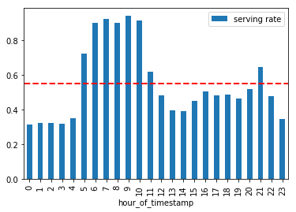
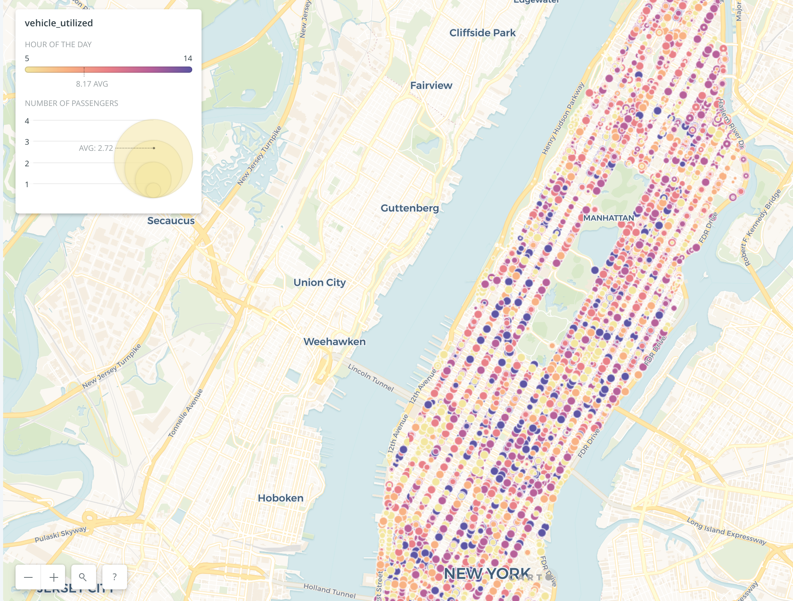
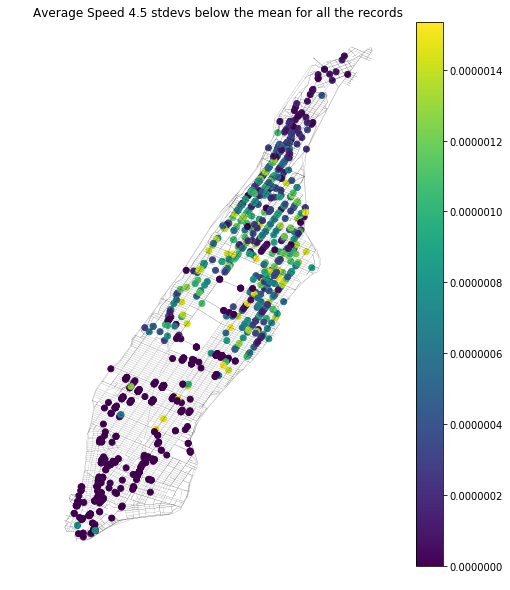

# Data_Visualization Final Challenge

# Ride Share Analysis

## Manrique Vargas mv1742@nyu.edu
## Yavuz Sunor ys3226@nyu.edu

1. [Q1](README.md#Q1)
1. [Q2](README.md#Q2)
1. [Q5](README.md#Q5)
1. [Q6](README.md#Q6)

# Q1

For the first question, we've worked on the requests dataset. We did the necessary manipulations using Python in Jupyter Notebook. We changed the timestamp to datetime to see it in hourly way. We calculated succesful trip ratios aggrageting in hourly fashion and plotted the trend for one day period. As you can see, serving rate reaches its peak in the morning rush hours and follows a uniform pattern in other times.    

# Q2

[link](https://sunoryavuz.carto.com/builder/7ee4c4c1-7575-48eb-a9c5-50950fb9c0c2/embed)

For the second question, we also used the requests dataset but this time we merged it with manhattan.geojson to visualize on a map. We created a served/not_served column in Jupyter notebook for categorizing trips. We then browsed the merged dataframe to CartoDB as a csv file. We wrote a simple SQL query to filter not_served trips and aggregating trips by each geolocation. As you can see, most of not_served trips concentrated near Eastern Manhattan mostly in Midtown and Central Park area. In terms of temporality, we see early hours in WTC area and late hours near Midtown/Central Park area.     

# Q5

[link](https://sunoryavuz.carto.com/builder/03ddfd80-20ca-43b5-bf58-2a5a07474c73/embed)

For the fifth question, we used vehicle_paths dataset. Using Jupyter Notebook, we filtered the data for the number of passengers below and equal 4 and created a geometry column out of Latitude and Longitudes. Then we browsed the dataframe to CartoDB as in the question 2. We applied a very similar SQL query and were able to visualize vehicles in terms of passenger numbers and time of the day. Because the maximum time limited up to 2pm for number of passengers below 4, we can only see a temporal pattern between 5am and 2pm. As you can see, both in terms of passenger numbers and time of the day, the city shows a uniform distribution.  

# Q6

You may see the Carto map in this [link](https://manriqvq.carto.com/builder/7da12f68-0d62-482a-88a2-446ba4c6903a/embed)
