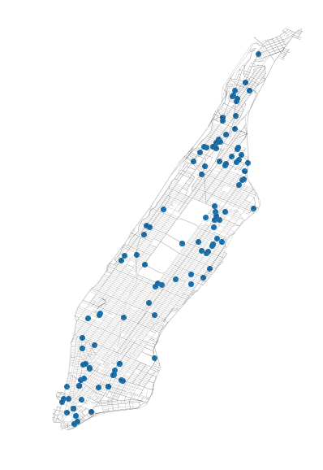

# Data_VIZ

# Ride Share Analysis

1. [Q1](README.md#Q1)
1. [Q6](README.md#Q6)

# Q1

# Q6

You may see the Carto map in this [link](https://manriqvq.carto.com/builder/7da12f68-0d62-482a-88a2-446ba4c6903a/embed)
